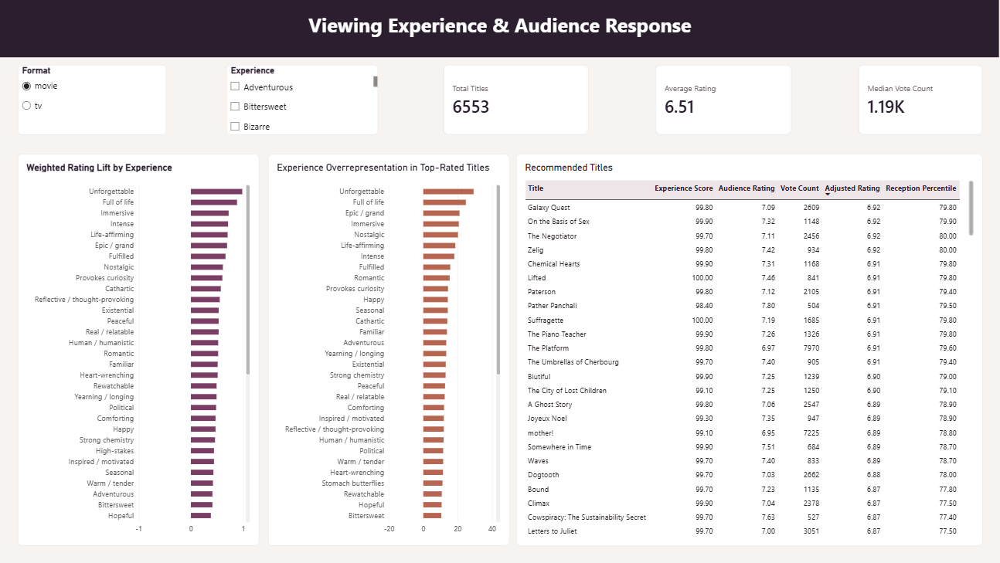
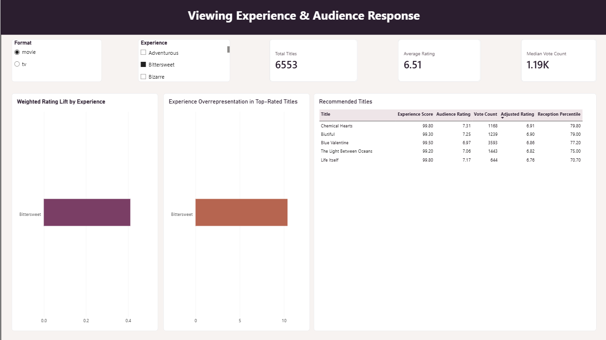
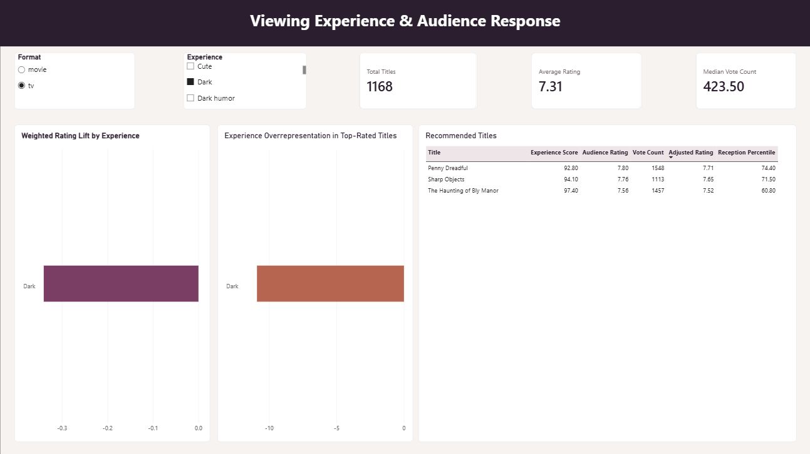

# Movies & TV Experience Recommender

An end-to-end data engineering, semantic scoring, analytics, and BI project.

This project explores a way to understand and recommend movies and TV shows based on the **experience a viewer is likely to have**, rather than relying only on broad labels like genre, popularity, or ratings.

Audience review language is used to build profiles across 55 viewing-experience attributes, including *Comforting*, *Intense*, *Romantic*, *Haunting*, *Immersive*, *Unforgettable*, and *Reflective / thought-provoking*.

The project has two main parts:

- a data pipeline that processes millions of IMDb reviews, enriches titles with TMDB metadata, creates semantic experience scores, and loads the final data into DuckDB
- an analytics and BI layer that examines how those viewing experiences relate to audience response and uses the results to surface recommendation candidates

## Project overview

The full workflow:

1. Ingests 5.57 million IMDb audience reviews.
2. Converts the raw JSON files to Parquet for more efficient processing.
3. Builds an inventory of frequently reviewed movie and TV titles.
4. Matches those titles to TMDB and adds structured metadata.
5. Cleans and validates the review data.
6. Uses sentence embeddings to compare review language with 55 experience definitions.
7. Aggregates review-level similarities into title-level experience profiles.
8. Loads title metadata and experience scores into DuckDB.
9. Uses SQL and Python to analyze how viewing experiences relate to audience ratings.
10. Identifies experiences that appear disproportionately often among the best-received titles.
11. Builds recommendation candidates using both experience strength and adjusted audience reception.
12. Presents the analysis in an interactive Power BI dashboard.

## Key results

### Data pipeline

- **5,571,499** raw IMDb reviews ingested
- Raw data reduced from **7.09 GB of JSON to 3.94 GB of Parquet**
- **8,841** candidate titles selected for enrichment
- **7,726** high-confidence IMDb-to-TMDB matches
- **7,721** final movie and TV title profiles
- **2,723,221** cleaned reviews used for experience scoring
- **55** viewing-experience attributes
- **424,655** final title-experience records
- **0** duplicate title-experience records in the final dataset

### Audience analysis

The final catalog contains:

- **6,553 movies**
- **1,168 TV shows**

Audience response differs noticeably by format:

| Media type | Average rating | Median rating | Median vote count |
| --- | ---: | ---: | ---: |
| Movie | 6.51 | 6.58 | 1,185 |
| TV | 7.31 | 7.47 | 424 |

Some viewing experiences show a clear positive association with audience ratings.

For movies, some of the largest vote-weighted rating lifts were:

- **Unforgettable:** +0.98
- **Full of life:** +0.88
- **Immersive:** +0.72
- **Intense:** +0.71
- **Life-affirming:** +0.70
- **Epic / grand:** +0.69
- **Nostalgic:** +0.61

For TV, the relationships were smaller overall, but several experiences still showed positive associations:

- **Unforgettable:** +0.40
- **Full of life:** +0.36
- **Seasonal:** +0.24
- **Happy:** +0.24
- **Epic / grand:** +0.23
- **Strong chemistry:** +0.22
- **Rewatchable:** +0.20

These results describe associations in the dataset and should not be interpreted as causal effects.

## Experience taxonomy

The 55 experience attributes are grouped into 10 categories:

- Emotion
- Overall experience
- Thinking / engagement
- Tone & style
- Story / world experience
- Connection
- Viewing style
- Atmosphere
- Themes / lens
- After-effect

Some examples are:

`Comforting`, `Bittersweet`, `Romantic`, `Intense`, `Immersive`, `Existential`, `Suspenseful / tense`, `Dark humor`, `Epic / grand`, `Strong chemistry`, `Slow-burn`, `Seasonal`, `Political`, `Unsettled`, and `Cathartic`.

The full taxonomy and definitions are in `05_experience_scoring.ipynb`.

## Semantic scoring

I tested two lightweight sentence-embedding models:

- `sentence-transformers/all-MiniLM-L6-v2`
- `BAAI/bge-small-en-v1.5`

MiniLM picked up some of the right emotional signals, but BGE produced more coherent matches in the test sample, so I used BGE for the full scoring run.

For each review:

1. The review text is converted into an embedding.
2. The embedding is compared with embeddings for all 55 experience definitions using cosine similarity.
3. The similarity values are added to running totals for the title.
4. The totals are divided by the number of reviews for that title to create average experience similarities.

All **2,723,221 cleaned reviews** contributed to scoring.

To make scoring the full dataset practical, each review was limited to a maximum model sequence length of 128 tokens.

I first benchmarked BGE locally, but CPU processing was too slow for the full dataset. The full embedding run was therefore completed on a Tesla T4 GPU in Google Colab.

The scoring input was processed in 11 batches. Title-level similarity totals from each batch were saved as checkpoints and combined locally afterward.

## Experience scores

The raw cosine similarity is kept in the final dataset, but cosine similarity is not a probability and is not especially intuitive on its own.

To make the results easier to interpret and query, I also calculate a **0-100 percentile score for each experience**.

For example:

> A Comforting score of 90 means the title ranks higher than about 90% of the other titles in the dataset for Comforting.

It does not mean the title is literally "90% comforting."

The percentile scores also make it easier to combine multiple experience signals in recommendation queries.

## Analytical warehouse

The final analytical database is built with DuckDB and contains two main tables.

### `titles`

One row per movie or TV show, with fields including:

- `title_key`
- TMDB ID
- media type
- title
- original title
- overview
- genres
- original language
- release date
- runtime
- status
- popularity
- TMDB vote information
- production information
- TV season and episode counts when available

### `experience_scores`

One row for each title and experience combination:

- `title_key`
- TMDB ID
- media type
- experience
- category
- percentile score
- raw similarity
- reviews used

The two tables are joined using `title_key`.

During validation, I found that numeric TMDB IDs are not unique across movies and TV shows. There were **81 IDs** that appeared once as a movie and once as a TV show.

To handle that, I created a combined `title_key` using the media type and TMDB ID:

```text
movie:155
tv:155
```

That key is used throughout the warehouse and analysis instead of relying on the numeric TMDB ID alone.

## Example experience query

The warehouse can rank titles using more than one viewing experience at a time.

For example, this query looks for titles that score highly across *Comforting*, *Warm / tender*, and *Romantic*:

```sql
SELECT
    t.title,
    t.media_type,
    t.release_date,
    ROUND(AVG(e.score), 2) AS experience_match_score,
    MIN(e.reviews_used) AS reviews_used
FROM experience_scores e
JOIN titles t
    ON e.title_key = t.title_key
WHERE
    e.experience IN (
        'Comforting',
        'Warm / tender',
        'Romantic'
    )
    AND e.reviews_used >= 100
GROUP BY
    t.title_key,
    t.title,
    t.media_type,
    t.release_date
HAVING COUNT(DISTINCT e.experience) = 3
ORDER BY experience_match_score DESC
LIMIT 20;
```

Instead of asking for a romance genre, this is closer to asking:

> What can I watch that feels comforting, warm, and romantic?

Additional recommendation and validation queries are included in the `sql/` folder.

# Audience response analysis

The second part of the project uses the warehouse to examine how viewing experiences relate to audience response.

The analysis focuses on three questions:

1. Which experiences are associated with higher audience ratings?
2. Which experiences appear more often among the best-received titles?
3. Which other well-rated titles strongly match those experiences?

Movies and TV shows are analyzed separately because they have different rating and vote-count distributions.

## Experience rating lift

For each experience, titles in the **top 25% of experience scores** are treated as strong matches.

Their ratings are then compared with the ratings of other eligible titles in the same media type.

Titles with fewer than 10 audience votes or a zero rating are excluded from this part of the analysis.

Two versions of rating lift are calculated:

- **Title-level rating lift**, where every title contributes equally
- **Vote-weighted rating lift**, where titles with more audience votes contribute more heavily

The weighted version helps check whether a result remains when the amount of audience evidence behind each rating is taken into account.

## Experience patterns among best-received titles

I also examine whether certain experiences appear disproportionately often among the strongest-performing titles.

Raw ratings alone can be misleading when a title has very few votes, so I calculate an adjusted rating using:

- the title's audience rating
- its vote count
- the average rating for its media type
- the median vote count for its media type

The adjustment pulls titles with relatively little audience evidence toward the media-type average.

Conceptually:

```text
adjusted_rating =
    (votes / (votes + median_votes)) * title_rating
    +
    (median_votes / (votes + median_votes)) * media_type_average_rating
```

Titles are ranked by adjusted rating within their media type, and the **top 20%** are treated as the best-received group.

For each experience, I compare:

- the percentage of top titles that strongly match the experience
- the percentage of the overall eligible catalog that strongly matches it

The difference between those values is the experience's **overrepresentation among top-rated titles**.

For movies, some of the largest differences were:

- **Unforgettable:** +29.2 percentage points
- **Full of life:** +24.7
- **Epic / grand:** +21.0
- **Immersive:** +20.6
- **Nostalgic:** +20.1

For TV, examples include:

- **Seasonal:** +18.2 percentage points
- **Unforgettable:** +15.4
- **Full of life:** +13.7
- **Strong chemistry:** +10.2
- **Cute:** +9.7
- **Happy:** +9.0
- **Epic / grand:** +9.0
- **Immersive:** +8.6

## Recommendation candidates

The recommendation layer uses all 55 experiences rather than manually selecting a small group of preferred themes.

A title qualifies as a recommendation candidate when it:

- has an experience score of at least **90**
- falls between the **60th and 80th percentile** for adjusted audience reception
- has at least the **25th-percentile vote count** for its media type

This is designed to surface titles that are:

- very strong matches for the selected experience
- reasonably well received by audiences
- supported by enough audience votes to make the rating more meaningful
- not already part of the very top group used to identify successful experience patterns

Candidates are ranked primarily by experience score, with adjusted rating used as a tie-breaker.

The final Power BI dataset keeps up to five recommendation candidates for each media type and experience.

# Power BI dashboard

The analysis is presented in an interactive Power BI dashboard.

The dashboard includes:

- a movie/TV format filter
- a viewing-experience filter
- total title, average rating, and median vote-count KPIs
- weighted rating lift by experience
- experience overrepresentation among top-rated titles
- recommended titles with experience score, audience rating, vote count, adjusted rating, and reception percentile

## Dashboard overview



## Example selections





The `.pbix` file is also included in the repository under `analysis/powerbi/`.

## Project structure

```text
movies-tv-experience-recommender/
│
├── data/
│   └── sample/
│       └── title_experience_sample.csv
│
├── notebooks/
│   ├── 00_imdb_source_profiling.ipynb
│   ├── 01_imdb_ingestion.ipynb
│   ├── 02_imdb_title_inventory.ipynb
│   ├── 03_tmdb_enrichment.ipynb
│   ├── 04_review_preprocessing.ipynb
│   ├── 05_experience_scoring.ipynb
│   └── 06_warehouse_build.ipynb
│
├── sql/
│   ├── example_queries.sql
│   └── validation_queries.sql
│
├── analysis/
│   ├── notebooks/
│   │   ├── 00_data_audit.ipynb
│   │   └── 01_analysis.ipynb
│   │
│   ├── sql/
│   │   ├── 01_analysis_dataset.sql
│   │   ├── 02_audience_response_profile.sql
│   │   ├── 03_experience_rating_lift.sql
│   │   ├── 04_successful_experience_patterns.sql
│   │   └── 05_recommendation_candidates.sql
│   │
│   └── powerbi/
│       ├── viewing_experience_analysis.pbix
│       │
│       ├── data/
│       │   ├── catalog.csv
│       │   ├── experience_insights.csv
│       │   └── recommendations.csv
│       │
│       └── screenshots/
│           ├── dashboard_overview.png
│           ├── dashboard_example_01.png
│           └── dashboard_example_02.png
│
├── .gitignore
├── README.md
└── requirements.txt
```

The large raw, processed, checkpoint, and warehouse files are excluded from GitHub through `.gitignore`.

## Notebook workflow

### Data engineering and experience scoring

| Notebook | What it does |
| --- | --- |
| `00_imdb_source_profiling.ipynb` | Profiles the raw IMDb review files and checks schema, volume, and missing values |
| `01_imdb_ingestion.ipynb` | Converts the raw JSON reviews to Parquet and validates the result |
| `02_imdb_title_inventory.ipynb` | Builds the title inventory and selects titles with enough review data |
| `03_tmdb_enrichment.ipynb` | Matches IMDb title strings to TMDB and retrieves metadata |
| `04_review_preprocessing.ipynb` | Filters, cleans, deduplicates, and prepares the reviews for scoring |
| `05_experience_scoring.ipynb` | Defines the taxonomy, compares embedding models, and creates the experience scores |
| `06_warehouse_build.ipynb` | Builds the DuckDB warehouse, validates the final tables, and runs recommendation queries |

### Analysis

| Notebook | What it does |
| --- | --- |
| `analysis/notebooks/00_data_audit.ipynb` | Audits the warehouse before analysis and checks title, rating, vote, and experience coverage |
| `analysis/notebooks/01_analysis.ipynb` | Runs the audience-response analysis, identifies successful experience patterns, builds recommendation candidates, and exports the Power BI datasets |

## Tools and technologies

The project uses:

- **Python**
- **pandas**
- **DuckDB**
- **SQL**
- **Sentence Transformers**
- **BAAI/bge-small-en-v1.5**
- **TMDB API**
- **Google Colab / Tesla T4**
- **Power BI**
- **DAX**
- **JupyterLab**

## Setup

Install the Python dependencies with:

```bash
pip install -r requirements.txt
```

The main data-engineering notebooks are organized in execution order from `00` through `06`.

The analysis notebooks are under:

```text
analysis/notebooks/
```

The full raw and processed datasets are not included in the repository because of their size.

A sample of the final title-experience output is included at:

```text
data/sample/title_experience_sample.csv
```

The GPU checkpoint files used during the full semantic scoring run are also excluded.

## Limitations

A few considerations when interpreting the results:

- The experience scores are derived from audience review language and should not be treated as definitive labels for a title.
- Some of the 55 experiences overlap in meaning, which can create correlated or noisy signals.
- BGE Small is mainly an English-language model, so non-English reviews may not be represented as well.
- Review text was capped at a maximum model sequence length of 128 tokens during scoring.
- Percentile experience scores are relative to the titles included in this dataset.
- I did not have a human-labeled validation dataset for the 55 experience attributes.
- Titles with fewer reviews may have less stable experience profiles.
- Audience ratings and vote counts come from TMDB and do not represent every viewer or viewing platform.
- The audience-response analysis is observational. Rating differences and experience patterns should be interpreted as associations rather than causal effects.
- Recommendation candidates are limited to titles present in the final analyzed catalog.